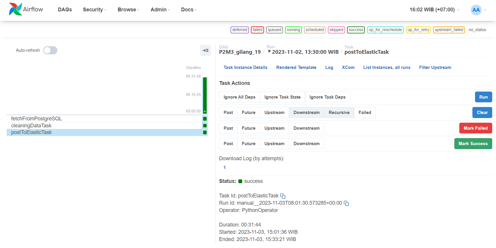
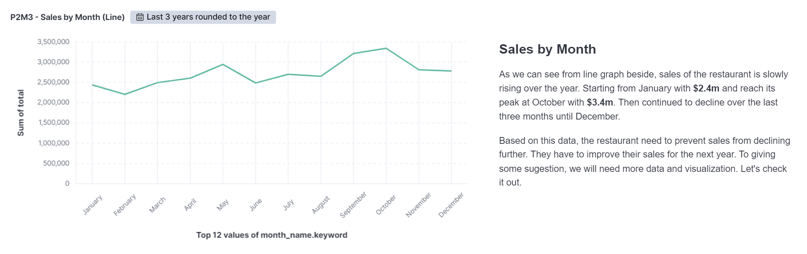
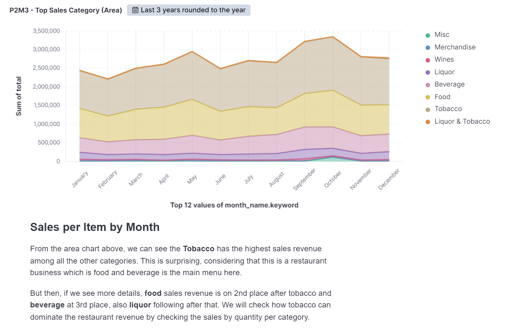
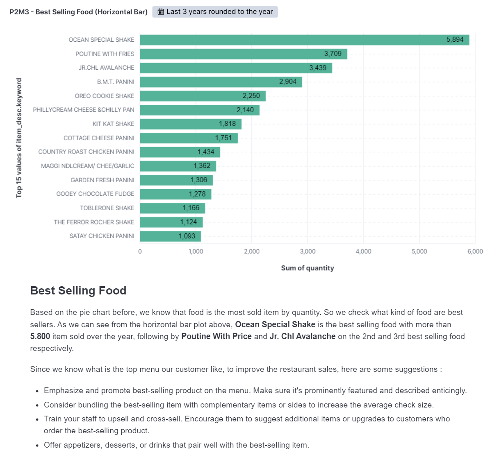
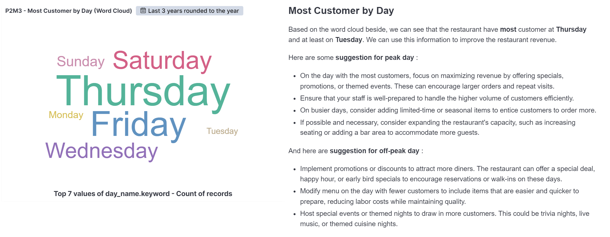
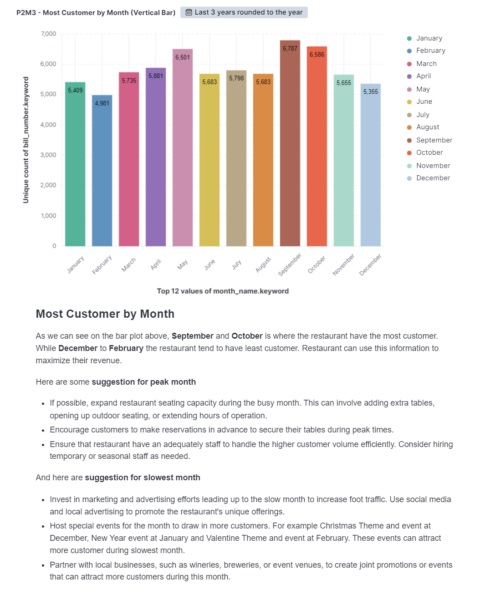

# ETL for Ocean Cafe Analysis using Airflow
This repository contains an automated scheduler for data pre-processing using Apache Airflow for the Ocean Cafe Analysis. The project is designed to help the restaurant to improve sales and provide the best possible service to its customers.

## Project Overview
This ETL projects perform a batch processing with scheduler for automation using Airflow, starting from data extraction from PostgreSQL Database, data cleaning using pandas and data validation using Great Expectation to ensure data quality and consistency. Those process generate a clean data which will then saved to Elasticsearch to be analyzed and visualized using Kibana. This analysis aims to help Ocean Cafe to improve sales and provide the best possible service to its customers.

## Tools and Technologies
- Docker
- Airflow
- Elasticsearch
- Kibana
- Python
- Jupyter Notebook
- Pandas

## File Description
- `Airflow_DAG.py` : Airflow DAGs containing the code to extract data from database, perform data cleaning and save data to Elasticsearch.
- `Data_Validation_GX.ipynb` : Jupyter Notebook containing the code for data validation using Great Expectation.
- `ocean_cafe_data_raw.csv` : CSV file containing the raw data of Ocean Cafe transaction.
- `ocean_cafe_data_clean.csv` : CSV file containing the clean data of Ocean Cafe transaction.
- `images/` : Folder containing data visualization and analysis result.
- `Ocean_Cafe_Analysis.pptx` : Power Point containing data visualization and analysis result for presentation.

## Airflow Process
Airflow process contains three main processes which is data extraction, data cleaning and data saving. This process is scheduled every 6.30 AM everyday. Here are the DAGs result.

## Exploratory Data Analysis
To achieve the Ocean Cafe goals, we need to perform data analysis and create a visualization for better understanding so we can get conclusion and give some suggestion for the restaurant.

### Sales by Month
---

### Sales per Category by Month
---

### Top Category Sold by Quantity
---

### Best Selling Food
---

### Most Customer by Day
---

### Most Customer by Month
---

## Conclusion
Based on the Exploratory Data Analysis we do, we found :
- The restaurant have **declining revenue** for the **last 3 month** that is **caused by** a **decrease in the number of customers** in the last 3 month. 
- The restaurant best-selling food is **Ocean Special Shake** and **Poutine with Fries**.
- Category product with highest sales for restaurant is **Tobacco**.

## Suggestion
- Consider bundling best selling food with complementary item or sides to increase the average check size.
- Train staff to upselling and cross-selling, Encourage them to suggest additional items or upgrade to customers who order the best-selling product.
- Ensure staff is well-prepared to handle higher volume of customer efficiently during busy day.
- Implement promotions or discounts to attract more diners. The restaurant can offer special deal, happy hour or early bird specials to encourages reservations or walk-ins during off-peak day.
- On slowest month, try to host special events for the month to draw in more customers. For example Christmas Theme and and event at December, New Year event at January and Valentine Theme and event at February.

## Acknowledgements
The Ocean Cafe Transaction data used in this project was obtained from [Kaggle](https://www.kaggle.com/datasets/gladinvarghese/cafeocean)
