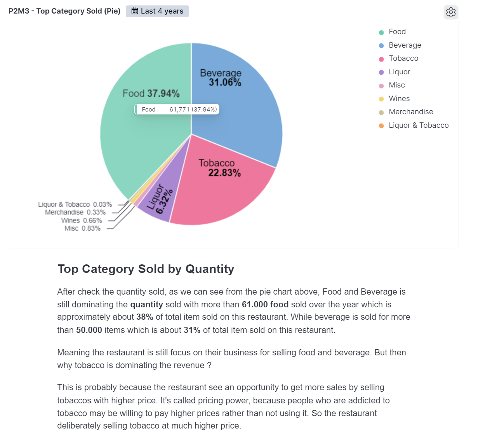

# ETL for Ocean Cafe Analysis using Airflow
This repository contains an automated scheduler for data pre-processing using Apache Airflow for the Ocean Cafe in Canada. The project is designed to help the restaurant to improve sales and provide the best possible service to its customers.

## Project Overview
This ETL projects perform a batch processing with scheduler for automation using Airflow, starting from data extraction from PostgreSQL Database, data cleaning using pandas and data validation using Great Expectation to ensure data quality and consistency. Those process generate a clean data which will then saved to Elasticsearch to be analyzed and visualized using Kibana. This analysis aims to help Ocean Cafe to improve sales and provide the best possible service to its customers.

## Tools and Technologies
- Docker
- Airflow
- Elasticsearch
- Kibana
- Python
- Jupyter Notebook
- Pandas

## File Description
- `Airflow_DAG.py` : Airflow DAGs containing the code to extract data from database, perform data cleaning and save data to Elasticsearch.
- `Data_Validation_GX.ipynb` : Jupyter Notebook containing the code for data validation using Great Expectation.
- `ocean_cafe_data_raw.csv` : CSV file containing the raw data of Ocean Cafe transaction.
- `ocean_cafe_data_clean.csv` : CSV file containing the clean data of Ocean Cafe transaction.
- `images/` : Folder containing data visualization and analysis result.
- `Ocean_Cafe_Analysis.pptx` : Power Point containing data visualization and analysis result for presentation.

## Airflow Process

## Exploratory Data Analysis
Here are the data analysis process.

### Sales by Month
---

### Sales per Category by Month
---

### Top Category Sold by Quantity
---

### Best Selling Food
---

### Most Customer by Day
---

### Most Customer by Month
---

## Conclusion
- Based on the Exploratory Data Analysis we do, we found that the restaurant have **declining revenue** for the **last 3 month** that is **caused by** a **decrease in the number of customers** in the last 3 month. 
- The restaurant best-selling food is **Ocean Special Shake** and **Poutine with Fries**.
- Category product with highest sales for restaurant is **Tobacco**.

## Suggestion
- Bundling best selling food with complementary item.
- Train staff to upselling and cross-selling.
- Ensure staff is well-prepared to handle higher volume of customer during busy hour
- Offer special discount for off-peak day.
- Host special events for the slowest month.

## Acknowledgements
The Ocean Cafe Transaction data used in this project was obtained from [Kaggle](https://www.kaggle.com/datasets/gladinvarghese/cafeocean)
